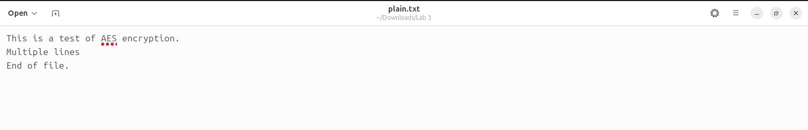
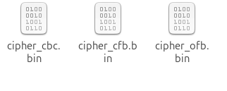
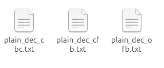

# Security_Lab03


# CSE-478: Introduction to Computer Security  
**Lab Report – Lab 3: Symmetric Encryption & Hashing**  
**Submitted by:** [Your Name]  
**Semester:** [e.g., Summer 2025]  
**Institution:** [Your University Name]  

---

## Objective

To practically explore symmetric encryption and hashing using OpenSSL and a hex editor like GHex in Ubuntu. The lab aims to provide hands-on experience with various encryption modes, one-way hash algorithms, HMAC, and data integrity concepts.

<br>
<br>

---

<br>
<br>

## Task 1: AES Encryption using Different Modes

We encrypted a text file using three AES-128 modes: CBC, CFB, and OFB. Below are the commands used:

1.first create a text file called `plain.txt` with some text.



### Encryption Commands

```bash
KEY=00112233445566778889aabbccddeeff
IV=0102030405060708

# AES-128-CBC
openssl enc -aes-128-cbc -e -in plain.txt -out cipher_cbc.bin -K $KEY -iv $IV

# AES-128-CFB
openssl enc -aes-128-cfb -e -in plain.txt -out cipher_cfb.bin -K $KEY -iv $IV

# AES-128-OFB
openssl enc -aes-128-ofb -e -in plain.txt -out cipher_ofb.bin -K $KEY -iv $IV
````

**After these commends we should have the following encrypted files:**



### Decryption Commands

```bash
openssl enc -aes-128-cbc -d -in cipher_cbc.bin -out plain_dec_cbc.txt -K $KEY -iv $IV
openssl enc -aes-128-cfb -d -in cipher_cfb.bin -out plain_dec_cfb.txt -K $KEY -iv $IV
openssl enc -aes-128-ofb -d -in cipher_ofb.bin -out plain_dec_ofb.txt -K $KEY -iv $IV
```

**After these commends we should have the following decrypted files:**



<br>
<br>

---

<br>
<br>

## Task 2: ECB vs. CBC – Image Encryption Analysis

A BMP image (`pic_original.bmp`) was encrypted using ECB and CBC modes. We then replaced the first 54 bytes of the encrypted image with the original BMP header using `ghex`.

### Encryption Commands

```bash
KEY=00112233445566778899aabbccddeeff
IV=ffeeddccbbaa99887766554433221100

# ECB mode
openssl enc -aes-128-ecb -e -in pic_original.bmp -out pic_ecb.bin -K $KEY -iv 00000000000000000000000000000000

# CBC mode
openssl enc -aes-128-cbc -e -in pic_original.bmp -out pic_cbc.bin -K $KEY -iv $IV
```

### Observation

* **ECB Mode:** Encrypted image still revealed visual patterns of the original picture. Block-based repetition preserved visible structure.
* **CBC Mode:** Image was visually indistinguishable, indicating stronger diffusion and better confidentiality.

<br>
<br>

---

<br>
<br>

## Task 3: Ciphertext Corruption Analysis

We encrypted a 64+ byte text file in four AES-128 modes and then manually flipped a bit at the 30th byte using `ghex`.

### Encryption Commands

```bash
KEY=00112233445566778899aabbccddeeff
IV=0102030405060708090a0b0c0d0e0f10

openssl enc -aes-128-ecb -e -in long.txt -out long_ecb.bin -K $KEY -iv 00000000000000000000000000000000
openssl enc -aes-128-cbc -e -in long.txt -out long_cbc.bin -K $KEY -iv $IV
openssl enc -aes-128-cfb -e -in long.txt -out long_cfb.bin -K $KEY -iv $IV
openssl enc -aes-128-ofb -e -in long.txt -out long_ofb.bin -K $KEY -iv $IV
```

### After Bit Corruption: Decryption Commands

```bash
openssl enc -aes-128-ecb -d -in long_ecb.bin -out dec_ecb.txt -K $KEY -iv 00000000000000000000000000000000
openssl enc -aes-128-cbc -d -in long_cbc.bin -out dec_cbc.txt -K $KEY -iv $IV
openssl enc -aes-128-cfb -d -in long_cfb.bin -out dec_cfb.txt -K $KEY -iv $IV
openssl enc -aes-128-ofb -d -in long_ofb.bin -out dec_ofb.txt -K $KEY -iv $IV
```

### Observations

* **ECB**: Only the corrupted block is affected. Others decrypt properly.
* **CBC**: The corrupted block and the next one are affected.
* **CFB & OFB**: Corruption propagates to a single byte or very limited range.

### Conclusion

Encryption modes have varying fault tolerance:

* ECB: localized error.
* CBC: affects two blocks.
* CFB/OFB: minimal propagation, more suitable for streams.

<br>
<br>

---

<br>
<br>

## Task 4: Padding Behavior

We examined padding necessity across encryption modes.

```bash
ls -l
```

### Observations:

* **ECB and CBC**: Require padding when plaintext size is not a multiple of block size.
* **CFB and OFB**: Operate in streaming mode, so they do not require padding.

<br>
<br>

---

<br>
<br>

## Task 5: Generating Message Digests

We hashed a file (`hashme.txt`) using three common digest algorithms.

```bash
openssl dgst -md5    hashme.txt    > hash_md5.txt
openssl dgst -sha1   hashme.txt    > hash_sha1.txt
openssl dgst -sha256 hashme.txt    > hash_sha256.txt
```

### Observation:

Each algorithm produced a different fixed-length hash. The stronger the algorithm (e.g., SHA-256), the longer the output and better the resistance to collisions.

<br>
<br>

---

<br>
<br>

## Task 6: HMAC – Keyed Hashing

We used HMAC with various keys and algorithms.

```bash
# HMAC-MD5
openssl dgst -md5 -hmac "secretkey" hashme.txt > hmac_md5.txt
openssl dgst -md5 -hmac "secretkeyanother" hashme.txt > hmac_md5_cpy.txt
openssl dgst -md5 -hmac "sec" hashme.txt > hmac_md5_cpy.txt

# HMAC-SHA1
openssl dgst -sha1 -hmac "secretkey" hashme.txt > hmac_sha1.txt

# HMAC-SHA256
openssl dgst -sha256 -hmac "longersecretkey123" hashme.txt > hmac_sha256.txt
```

### Key Size Insight:

No fixed-size key is enforced in HMAC. Internal padding is used if the key is shorter than the block size; if longer, it's hashed.

<br>
<br>

---

<br>
<br>

## Task 7: Bit Flip Hash Behavior

We flipped the first bit in a file and compared hashes.

```bash
# Original file
openssl dgst -md5    bitflip.txt   > H1_md5.txt
openssl dgst -sha256 bitflip.txt   > H1_sha256.txt

# After flipping first bit
openssl dgst -md5    bitflip2.txt  > H2_md5.txt
openssl dgst -sha256 bitflip2.txt  > H2_sha256.txt
```

### Observation:

* A **single-bit flip** causes completely different hash values.
* Demonstrates the **avalanche effect**, a desirable property of secure hash functions.

<br>
<br>

---

<br>
<br>
<br>

---

## Conclusion

This lab helped solidify our understanding of encryption modes, the impact of ciphertext corruption, padding mechanisms, and the behavior of cryptographic hash functions. OpenSSL provided a powerful and flexible toolkit for these experiments.

---

## Attachments

* `plain.txt`, `cipher_*.bin`, `dec_*.txt`
* `pic_ecb_fixed.bmp`, `pic_cbc_fixed.bmp`
* `hashme.txt`, `hash_*.txt`, `hmac_*.txt`
* `bitflip.txt`, `bitflip2.txt`, `H1_*.txt`, `H2_*.txt`
* Screenshots of `ghex` edits and image results

---


